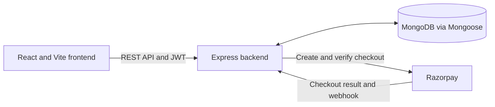

# CanteenEats

CanteenEats is a campus canteen ordering and operations platform. Students can browse a menu, place and track orders, and see queue estimates. Staff manage kitchen order status, while administrators manage menu items, staff accounts, inventory, and operational insights.

## Overview

The application brings student ordering, kitchen workflow, and canteen operations into a single web client and REST API. Queue and wait estimates help students understand order progress; operational views give staff and administrators visibility into service and demand.

## Key Features

- Student registration and JWT login, with role-based student, staff, and admin access.
- Menu browsing, text search, category filters, cart, and order confirmation.
- Razorpay Standard Checkout integration configured for Test Mode; the backend verifies payment before paid orders enter the queue.
- Daily human-readable queue tokens, FIFO order assignment, order tracking, and dynamic preparation ETA estimates.
- Kitchen order views and status workflow: `QUEUED` → `PREPARING` → `READY` → `COMPLETED`, with cancellation supported.
- Admin menu and staff account management; staff and admins can adjust inventory and review low-stock items.
- Analytics for order totals, revenue, wait time, popular items, peak hours, trends, categories, and a simple explainable demand forecast.

## Queue and ETA Model

Queue order is FIFO. The ETA service estimates preparation workload from the items and their snapshotted preparation times, then assigns queued orders to virtual kitchen slots in FIFO order. `KITCHEN_PARALLEL_CAPACITY` controls the number of slots (default `2`); current `PREPARING` orders seed their remaining workloads. With at least five eligible completed timing samples from the recent history, the baseline is calibrated using the median actual-to-baseline ratio, bounded between `0.75` and `1.50`. Otherwise, the calibration factor is `1`.

Queued orders are scheduled against the virtual slots. A preparing order's estimate uses its current progress and remaining scheduled work. Queue responses are recalculated from the current active-order snapshot, so estimates can change as orders advance. This deterministic scheduling and historical calibration are operational estimates, not machine learning. See [docs/ETA_MODEL.md](docs/ETA_MODEL.md) for the calculation details.

## User Roles

| Role | Capabilities |
| --- | --- |
| `STUDENT` | Register, browse the menu, place paid orders, and track order and queue progress. |
| `STAFF` | View kitchen queues and orders, manage order statuses, and review or adjust inventory. |
| `ADMIN` | Manage menu items and staff accounts, access operational analytics, and manage inventory. |

Public registration always creates a `STUDENT`. Staff account provisioning is restricted to development mode and authenticated administrators.

## Technology Stack

- **Frontend:** React 18, Vite 5, JavaScript ES modules, Tailwind CSS 3, React Router 6, Axios.
- **Backend:** Node.js, Express 4, JavaScript ES modules, Mongoose 8, MongoDB, JWT, bcryptjs.
- **Payments:** Razorpay Standard Checkout and server-side payment verification. The current setup guide covers Test Mode only.

## Architecture



The frontend handles role-based screens and sends API requests. The backend validates requests, enforces authentication and authorization, runs order, queue, inventory, and analytics logic, and persists records in MongoDB. Razorpay handles checkout; payment verification runs through the backend.

## Project Structure

```text
backend/
  scripts/          # Opt-in demo menu seed and repair scripts
  src/controllers/  # Request handlers
  src/models/       # Mongoose schemas
  src/routes/       # API route groups
  src/services/     # Order, payment, queue, and ETA logic
  test/             # Node.js tests
frontend/
  public/           # Static assets and menu images
  src/components/   # Shared UI
  src/context/      # Authentication and cart state
  src/layouts/      # Role-specific layouts
  src/pages/        # Application screens
  src/routes/       # Client-side route guards
docs/               # Setup and implementation notes
postman/            # Postman workspace globals
```

## Local Development

Requirements: Node.js with npm and a reachable MongoDB instance. From the repository root:

```sh
git clone <repository-url>
cd canteen-management
cd backend && npm install
cp .env.example .env
```

Set `MONGODB_URI`, a random `JWT_SECRET` of at least 32 characters, and `CLIENT_URL` in `backend/.env`. Configure Razorpay Test Mode values for checkout (see [docs/RAZORPAY_SETUP.md](docs/RAZORPAY_SETUP.md)). In another terminal, install the client and configure its API URL:

```sh
cd frontend
npm install
cp .env.example .env
```

Start the API from `backend/` with `npm run dev` (port `5001` by default), and the client from `frontend/` with `npm run dev` (Vite normally uses port `5173`). To run the API without watch mode, use `npm start`. Build and locally preview the production frontend with `npm run build` and `npm run preview` from `frontend/`.

## Environment Variables

| File | Variable | Purpose |
| --- | --- | --- |
| `backend/.env` | `PORT` | API port; defaults to `5001`. |
| `backend/.env` | `MONGODB_URI` | MongoDB connection string. |
| `backend/.env` | `JWT_SECRET` | Signing key; required and at least 32 characters. |
| `backend/.env` | `CLIENT_URL` | Allowed browser origin for CORS. |
| `backend/.env` | `RAZORPAY_KEY_ID`, `RAZORPAY_KEY_SECRET` | Razorpay server checkout credentials. |
| `backend/.env` | `RAZORPAY_WEBHOOK_SECRET` | Secret used to validate payment webhooks. |
| `backend/.env` | `KITCHEN_PARALLEL_CAPACITY` | ETA scheduler's virtual kitchen slot count; defaults to `2`. |
| `frontend/.env` | `VITE_API_URL` | API base URL, e.g. `http://localhost:5001/api`. |
| `frontend/.env` | `VITE_RAZORPAY_KEY_ID` | Included in the example template; current checkout uses the public key returned by the backend. |

Use the committed `.env.example` files as templates. Never commit `.env` files, database credentials, JWT keys, or Razorpay secrets. Frontend variables are included in the browser bundle and must never contain secrets.

## Demo Menu Data

The seed script is opt-in, development-only, and skips existing products by case-insensitive name. Configure the development MongoDB URI first, then run from `backend/`:

```sh
NODE_ENV=development npm run seed:demo-menu
```

The seed adds missing items from `src/data/demoMenu.js`; it does not delete or update existing products. `npm run repair:demo-menu` is a separate data-repair script that requires `NODE_ENV=development` and the explicit `--apply` flag. Review its source and the target database before using it.

## API

The API is rooted at `/api` and grouped under `/auth`, `/menu`, `/orders`, `/payments`, `/staff`, `/inventory`, and `/analytics`. These groups provide authentication, menu access, student ordering and tracking, payment checkout/verification, staff queue operations, stock management, and operational reporting. `GET /api/health` is the health check. All routes and access rules are defined in `backend/src/routes/`.

## Testing and Validation

- Backend tests: `cd backend && npm test` (Node.js built-in test runner).
- Frontend production build: `cd frontend && npm run build`.
- Frontend local production preview: `cd frontend && npm run preview` after building.

## Deployment

The intended hosted shape is frontend hosting → backend hosting → MongoDB Atlas, with Razorpay configured for the backend. Set the frontend API URL and backend CORS origin to the deployed hosts, provide secrets through each host's environment configuration, and use HTTPS. No hosting provider or deployment URL is configured in this repository. Razorpay live credentials and production webhook setup require deployment-specific review; see [docs/RAZORPAY_SETUP.md](docs/RAZORPAY_SETUP.md) before configuring payments. A separate `docs/DEPLOYMENT.md` is not currently present.

## Security Notes

Passwords are hashed with bcryptjs; authenticated API requests use JWTs and role authorization. Public registration assigns only the student role. Development staff/admin creation is guarded by development mode and admin authorization. Payment signatures and captured payment details are verified server-side. These controls do not constitute a production security audit or certification.

## Documentation

- [ETA model](docs/ETA_MODEL.md)
- [Razorpay Test Mode setup](docs/RAZORPAY_SETUP.md)
- [API contract](docs/API_CONTRACT.md) (currently a placeholder)

## Project Status

CanteenEats is an actively developed, locally runnable project with student, staff, and admin flows intended for development and demonstration. Hosting is not yet connected.

## License

No license has currently been specified.
